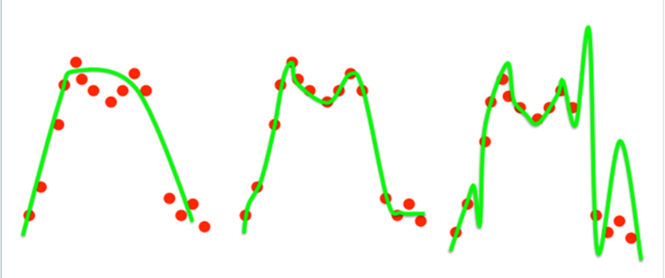
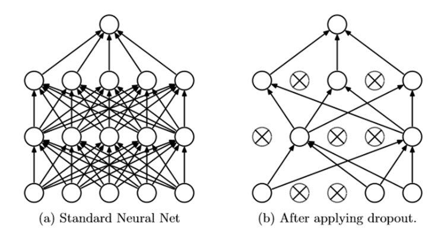

# Dropout

+ overfitting에 대한 해결책으로 나온 방법. 

### overfitting

+ 학습 데이터에 지나치게 집중을 함으로써 실제 test 데이터에서는 결과가 더 나쁘게 나오는 현상.
+ 지나친 단순화를 통해 정확도가 떨어지는 경우는 **underfitting**, 너무 학습데이터에 맞추는 경우를 **overfitting**이라고 한다.
+ 
  + 순서대로 underfitting, 제대로 학습, overfitting이다.

### Dropout

+ 네트워크의 일부를 생략하는 것. 생략한 네트워크는 학습에 영향을 끼치지 않게 된다.

  

+ 이 방법은 여러개의 모델을 만드는 대신에 모델 결합에 의한 투표 효과(voting)와 비슷한 효과를 내기 위해 학습 사이클이 진행되는 동안 무작위로 일부 뉴런 생략한다. 

+ 실제로 실행을 시킬 때에는 생략된 많은 모델을 따로 실행시키는 것이 아니라 생략된 모델들이 모두 파라미터를 공유하기 때문에 모두 가각의 뉴런들이 존속할(dropout 하지 않을) 확률을 각각의 가중치에 곱해주는 형태가 된다.

+ 학습시에는 뉴런은 존속할 확률 P로 학습을 진행하고, 실행할 때는 각각에 넷에 얻어진 가중치에 존속할 확률 P를 곱해준다.

### Ref.

[라온피플](<https://blog.naver.com/laonple/220818841217>)

